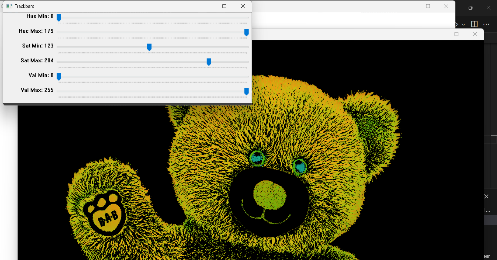
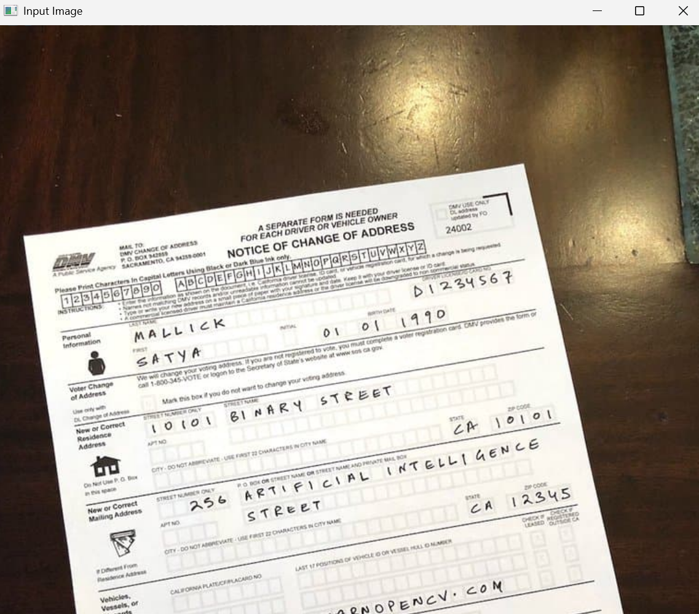
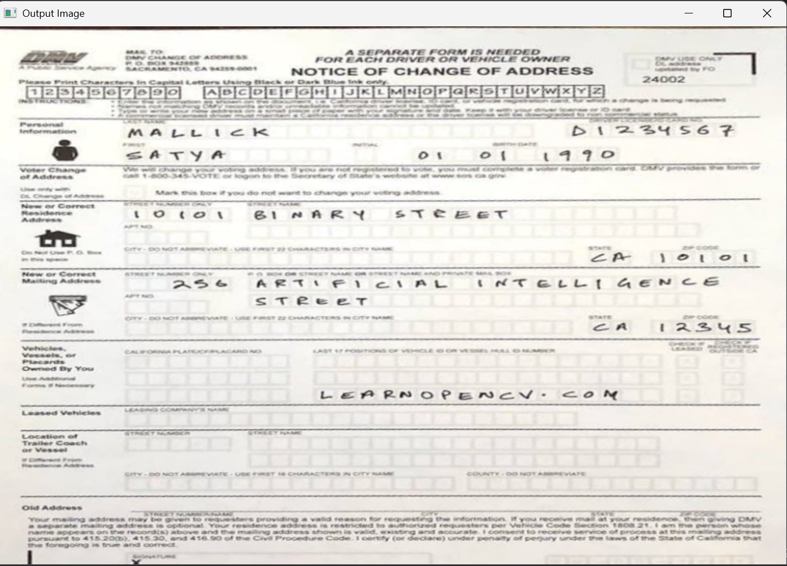
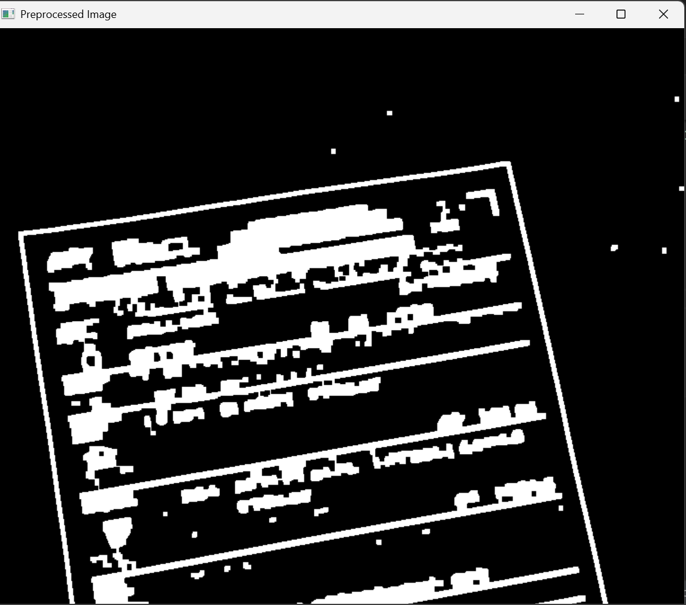
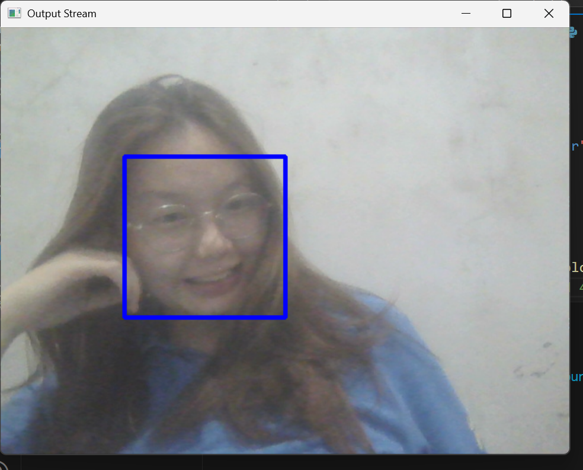
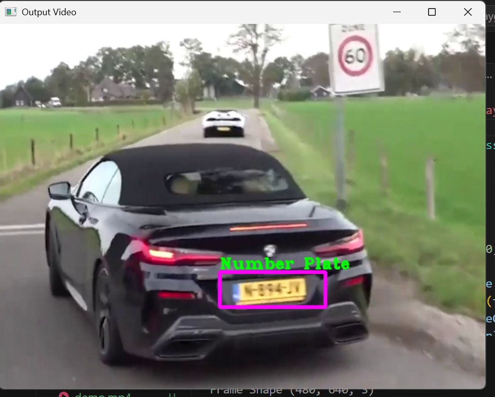
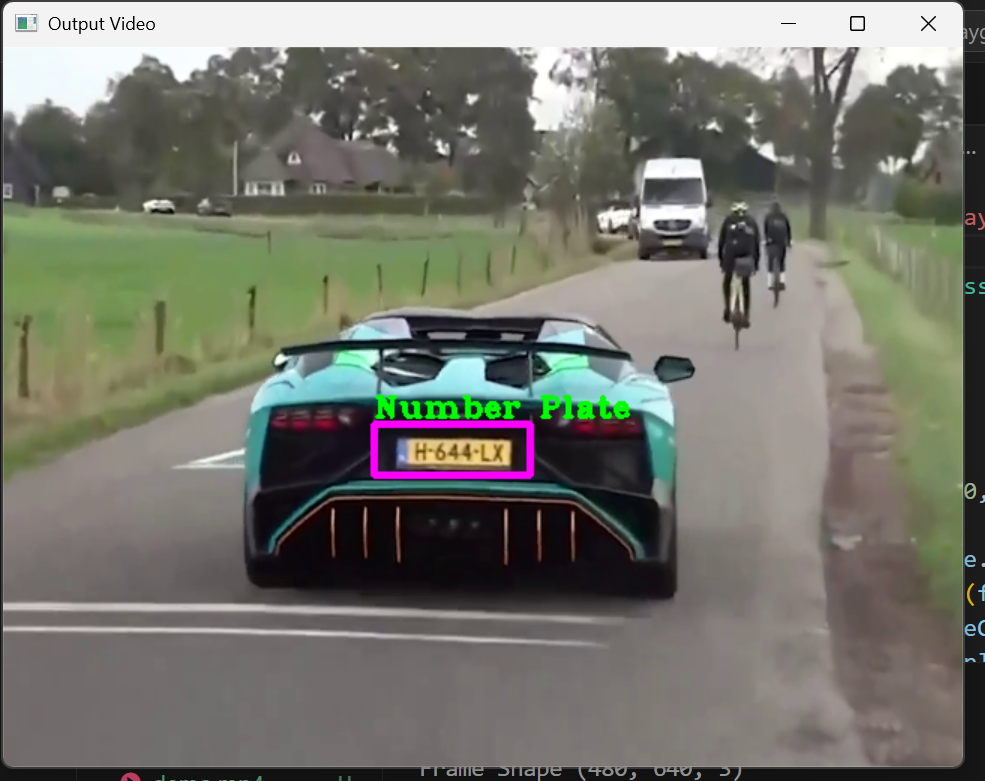

# AI Playground

This repository is a collection of my AI mini projects using Python and various AI libraries.  

---

## Table of Contents
- [Overview](#overview)
- [Mini Projects](#mini-projects)
  - [1. Color Detection](#1-color-detection)
  - [2. Document Scanner](#2-document-scanner)
  - [3. Face Detection](#3-face-detection)
  - [4. Number Plate Detection](#4-number-plate-detection)
- [Installation](#installation)

---

## Overview
The **AI Playground** is intended for learning and experimenting with OpenCV's core features, covering tasks like color-based segmentation, object detection, and image transformation.  

---

## Mini Projects

### **1. Color Detection**
**What?**  
This project detects specific colors in an image using HSV (Hue, Saturation, Value) color space. A set of trackbars allows real-time adjustment of the HSV range, making it easier to isolate and analyze desired colors.  

**Where?**  
This project can be applied to various real world problems, such as fruit ripeness in Agriculture sector, traffic light recognition in Smart City, or skin color changes monitoring in Healthcare sector.  

**Features:**
- Real-time HSV range adjustment using trackbars
- Color masking with `cv2.inRange()`
- Display of original image, HSV view, and masked output

**How It Works?**
1. Load the image and convert it to HSV.
2. Get HSV min/max values from trackbars.
3. Apply color filtering to create a mask.
4. Display the original image, HSV result, and mask.

**Screenshot:**  
  
  

---

### **2. Document Scanner**
**What?**  
This project detects and extracts a document from an image by identifying its contours and applying a perspective transformation. It automatically finds the largest quadrilateral shape (the document), reorders its corner points, and warps the perspective so the document appears as if scanned from above.

**Where?**  
This project can be applied to real-world problems such as mobile document scanning apps, receipt and bill digitization in accounting, form processing in administration, or archival of physical documents for research and legal purposes.

**Features:**
- Automatic document contour detection using cv2.findContours()
- Corner point reordering for accurate perspective warping
- Preprocessing with grayscale conversion, Canny edge detection, dilation, and erosion
- Output of a cropped, straightened version of the document

**How It Works?**
1. Load the image and create a copy for contour drawing.
2. Preprocess the image (convert to grayscale), apply Canny edge, apply dilatation and erosion).
3. Find contours and detect the largest quadrilateral (document outline).
4. Reorder points to maintain correct corner positions.
5. Warp perspective using cv2.getPerspectiveTransform() and cv2.warpPerspective() to obtain a flat, scanned-like image.
6. Display the results.

**Screenshot:**  
  
  
  

---

### **3. Face Detection**
**What?**  
This project detects human faces in real-time using a webcam feed and OpenCV’s pre-trained Haar Cascade classifier. Detected faces are highlighted with a bounding box, enabling basic face localization for further applications.

**Where?**  
This project can be applied to various real-world problems such as security surveillance, attendance systems, face-based user authentication, and video conferencing enhancements.

**Features:**
- Real-time face detection from webcam feed
- Haar Cascade-based detection (haarcascade_frontalface_default.xml)
- Bounding box overlay for each detected face
- Adjustable detection parameters for accuracy and performance
  
**How It Works?**
1. Load the Haar Cascade classifier for frontal face detection.
2. Capture frames from the webcam in real time.
3. Convert frames to grayscale for efficient face detection.
4. Detect faces using detectMultiScale() with scale factor and neighbor parameters.
5. Draw rectangles around each detected face in the frame.
6. Display the output in a live video window until the user presses 1.

**Screenshot:**  
  

---

### **4. Number Plate Detection**
**What?**  
This project detects vehicle number plates in a video stream using OpenCV’s pre-trained Haar Cascade classifier. It highlights detected plates with bounding boxes and allows saving cropped plate images upon a key press.

**Where?**  
This can be applied in real-world scenarios such as automated toll collection, parking management systems, traffic monitoring, and law enforcement for vehicle identification.

**Features:**
- Real-time number plate detection from video feed
- Haar Cascade-based detection (haarcascade_russian_plate_number.xml)
- Cropped number plate extraction and saving
- Bounding box and label overlay for detected plates

**How It Works?**
1. Load the Haar Cascade classifier for Russian-style number plate detection.
2. Capture frames from a video file.
3. Resize frames to a standard size for consistent detection performance.
4. Convert frames to grayscale to optimize processing.
5. Detect number plates using detectMultiScale() with adjustable parameters.
6. Draw bounding boxes and add labels to each detected plate.
7. Extract the plate region (ROI) and display it in a separate window.
8. Save plate images when the user presses 1.

**Screenshot:**  
  
  

---

## Installation
1. Clone this repository:
   ```bash
   git clone https://github.com/haemuucia/my-ai-playground.git
   cd my-ai-playground
   playgroundvenv\Scripts\activate
